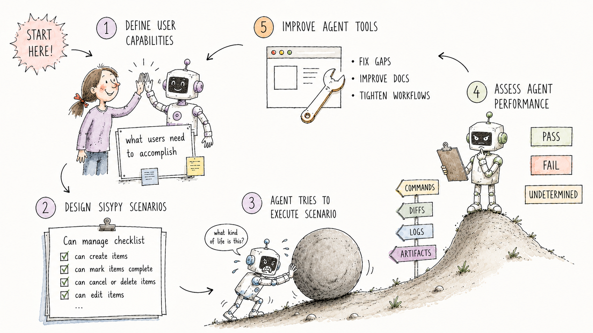

# Sisypy Agentic Testing

A toolkit for designing, running, and assessing agent performance.



Programmatic tests check whether code behaves correctly when called correctly. Sisypy checks whether an agent, given only what a real user would provide, can discover the right path, act safely, produce evidence, and fulfill both the product's purpose and the user's purpose.

Sisypy is a scenario-based evaluation harness for agentic software work. It runs user-shaped tasks against a codebase, freezes evidence, assesses claims against what actually happened, and separates actor failures, harness uncertainty, and legitimate product blockers.

The name is load-bearing: every run is an agent pushing a test up a hill. The point is not that the work ends. The point is to make the climb observable, fair, and repeatable.

## Give This to Your Agent

If you want an agent to add Sisypy to a repo and design the right tests, start with this:

```text
Add Sisypy agentic testing to this repository.

Please:
1. Clone https://github.com/peteromallet/sisypy and run `python3 -m pip install -e .` from the Sisypy repository root. Do not import it from the inner `sisypy/` package directory.
2. From the Sisypy repo root, run `python3 scripts/sync_agent_skills.py --apply` so the Sisypy skills are available to Claude/Codex.
3. Use the skills in order: `sisypy-understand`, then `sisypy-design`.
4. During `sisypy-design`, discover this repo's real user workflows, agent-facing surfaces, CLIs, docs, tools, and failure modes. Do not mutate files, spend money, or run untrusted code during discovery.
5. Produce a scenario-candidate table with one row per user ask: `| # | User ask | Canonical path | Failure mode | Evidence to capture | Shape |`.
6. Share that table and tell them you're waiting for their feedback. Tell them users often have a more lateral of things than AI. Do not advance to embedding or authoring until the user confirms.
7. After confirmation, use `sisypy-embed` and `sisypy-author` to build the minimal adapter, runner, and one or two fake/no-GPU structural scenarios.
8. Run one scenario, inspect the frozen evidence pack, and fix capture before adding more. For recurring runs later, use `sisypy-run`.

9. Core rule: grade evidence, not the actor's narrative. If a claim cannot be verified from frozen evidence, mark it undetermined.
```

## Quick Start

Install Sisypy from the repository root:

```bash
git clone https://github.com/peteromallet/sisypy
cd sisypy
python3 -m pip install -e .
python3 -m sisypy --help
sisypy --help
```

Sync the in-repo agent skills into local Claude and Codex skill directories:

```bash
python3 scripts/sync_agent_skills.py --apply
```

The sync creates symlinks for missing skills only. It never overwrites an existing skill.

For quick local checks without installing, put the repository root on `PYTHONPATH`:

```bash
PYTHONPATH=. python -m sisypy --help
PYTHONPATH=. python examples/minimal_runner.py --help
```

Do not set `PYTHONPATH` to the inner `sisypy/` package directory. Python needs the repository root so `import sisypy` resolves the package correctly.

## Minimal Embedding

Projects provide a small adapter and then expose Sisypy through the public `cli()` helper:

```python
from sisypy import cli
from tests.agentic.adapter import MyProjectAdapter

def main(argv=None):
    return cli(MyProjectAdapter(), argv=argv)
```

Then run project scenarios through that entry point:

```bash
python -m tests.agentic.runner --help
python -m tests.agentic.runner <scenario> --actor fake --verbose
```

Start with no-GPU structural scenarios. The fake actor is a plumbing check, not proof that the product works.

## Repository Layout

| Path | Purpose |
|------|---------|
| `pyproject.toml` | Package metadata, build backend, console script |
| `.agents/skills/` | Canonical Sisypy agent skill files |
| `scripts/sync_agent_skills.py` | Syncs Sisypy skills into local Claude/Codex skill directories |
| `sisypy/` | Importable Python package |
| `docs/` | Skill-oriented guides, API, evidence, and maintainer notes |
| `examples/` | Offline examples using the public API |
| `tests/` | Native Sisypy tests |
| `boulder.toml` | Package/project configuration |

## Skill Path

Read these by job, not as a book:

| Job | Read | Output |
|---|---|---|
| Understand the method | `sisypy-understand` / [Applied Philosophy](docs/applied-philosophy.md) | Shared mental model: user-agent-system loop, evidence over narrative, roles, signal tiers |
| Choose what to test | `sisypy-design` / [Scenario Design](docs/scenario-design.md) | Scenario-candidate table, first scenario recommendation, evidence needs, AWAITING_USER_CONFIRMATION checkpoint |
| Wire Sisypy into a repo | `sisypy-embed` / [Embedding Guide](docs/embedding.md) | Adapter, runner, first scenario YAML, fake structural run |
| Write real scenarios | `sisypy-author` / [Scenario Authoring](docs/scenario-authoring.md) | Brief, rubric, capture requirements, reviewer pass |
| Run it later | `sisypy-run` / [Running and Maintaining](docs/running-and-maintaining.md) | Run report, regressions, undetermined items, scenario lifecycle decisions |
| Debug proof and capture | `sisypy-debug-evidence` / [Evidence Model](docs/evidence.md) | Evidence-pack and proof-ladder decisions |
| Use public APIs | [API Reference](docs/api.md) | Stable helper names and runner integration points |
| Track known gaps | [Roadmap](docs/roadmap.md) | Follow-up implementation work |

## Development

Run native Sisypy tests:

```bash
PYENV_VERSION=3.11.11 python -m pytest
```

Run smoke checks:

```bash
PYENV_VERSION=3.11.11 python -m sisypy --help
PYENV_VERSION=3.11.11 python -m sisypy.runner --help
PYENV_VERSION=3.11.11 PYTHONPATH=. python examples/minimal_runner.py --help
```

No CI workflow is checked in here yet. If Sisypy becomes its own repository root, put CI under `.github/workflows/`. If it is versioned inside a parent repository, run these commands from the parent CI with `working-directory: sisypy`.
